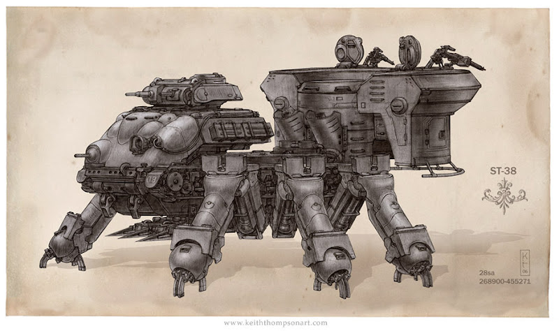

The classic artillery platform of the Ivory legions, equipped with two mortar canons on its back and six legs, allowing it to navigate any terrain. 

Akira and Wes discovered that smaller infantry automatons reside inside the hexapod as additional security. 

