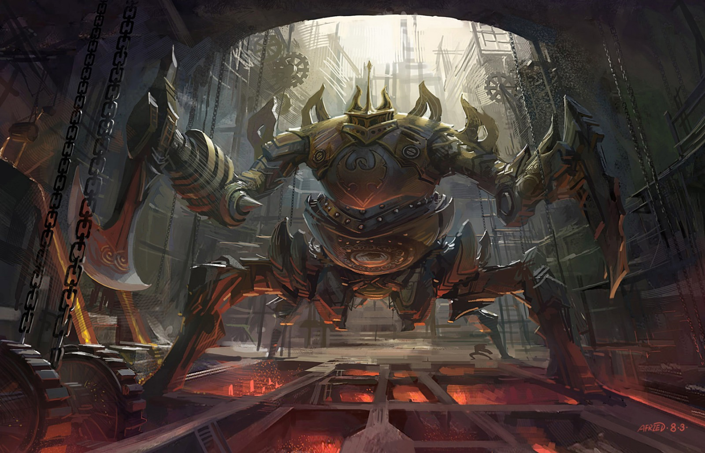

The 3rd generation heavy juggernaut class equipped with 4 legs to prevent easy immobilization and 4 arms to combat threats from all sides at once. The juggernaut class is equipped with axe arms, scythe arms and chain modules allowing the juggernaut to perform short ranged attacks. 

