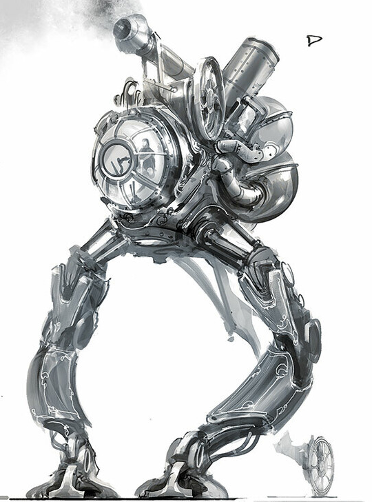

A mobile command center, empowering nearby automatons. Automatons can operate independently but their effectiveness and coordination is greatly increased if a engineer operated walker is nearby. This all-terrain design has been used since the second generation of the ivory legions. 

