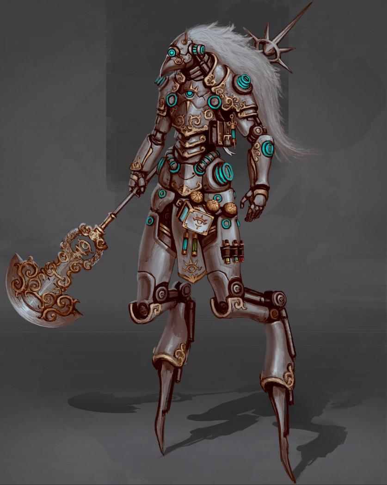

A generation 4 automaton designed for close quarter operations, equipped with powerful legs capabale of a sustained sprint outpacing horses and several weapon options for diverse combat situations. 

