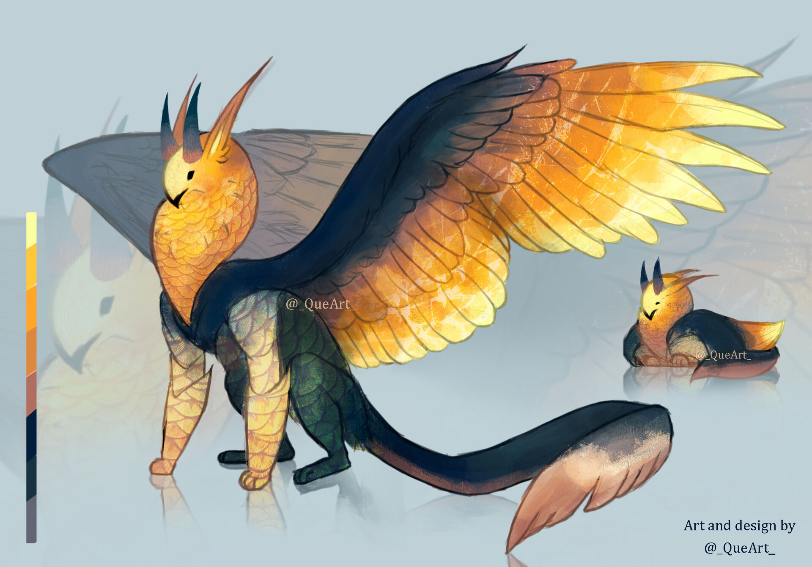
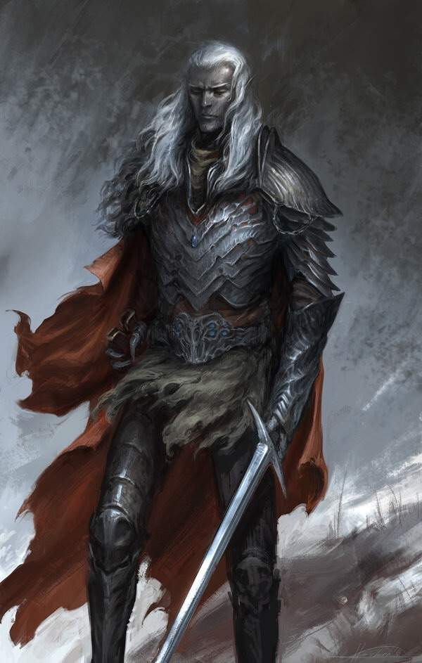

**Pronouns:** He/Him

A drow Golden Knight and aspect of Tenacity. He has fallen in the ranks after the Aneridge Scourge, but recently has once more been promoted to golden knight before the Ivory threat emerged and attacked Aneridge.

Has helped the party escape the head quarters of the Brightstriders and covered for party.
He was Noon's instructor back when she was training to become a paladin in the Brightstrider dominion. He is also the one who gave Noon her nameblade.

Has made a deal with Friij, the Aspect fo Everfrost in order to find the remaining survivor orphans in the Frostfang Mountains.

Has helped Noon fight Karim back in the Starwielder's Academy.

Is part of a secret organization called the Keepers.

Partnered with Lanost, a Goldwing.

> Lanost; A goldwing and powerful fey companion from the feywild.

> Guldor; A drow and the Golden General