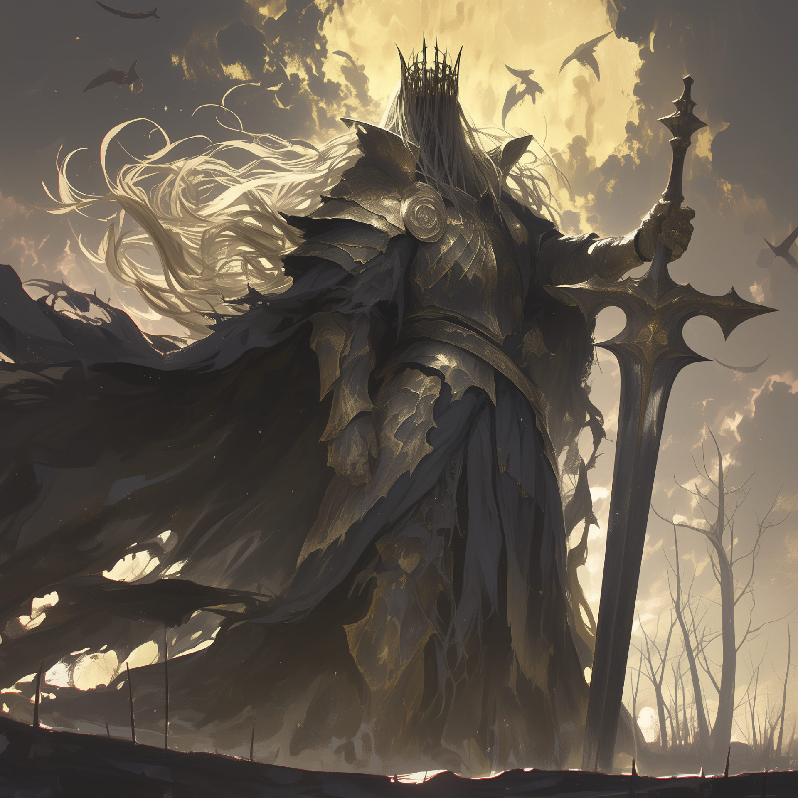
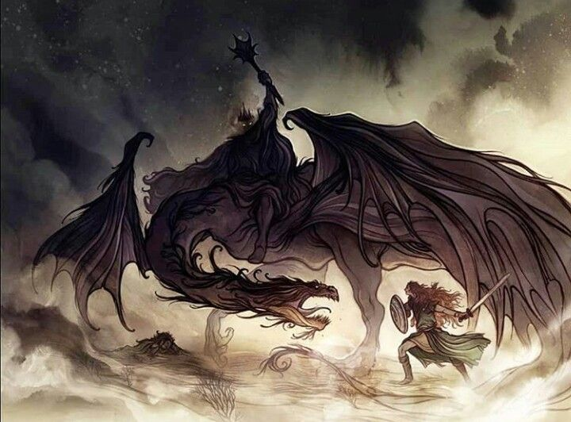

**Pronouns:** He/Him

Golden Knight of the Brightstrider Dominion and Aspect of the Eternal Fight.

Partnered with Sir Scrungle his loyal steed. The party has learned that Sir Scrungle is an Apex predator of the abyss and has the ability to smell the arcane.

A mimic knight, he himself originates from the abyss and it is unclear how he reached the surface. Eventually got defeated during the war of light and shadow in Menzo by party.

> Hallorn the Faceless as it unleashes its many powerful mouthes to devour its enemies on the battlefield

> Sir Scrungle with Hallorn riding atop the demonic steed.