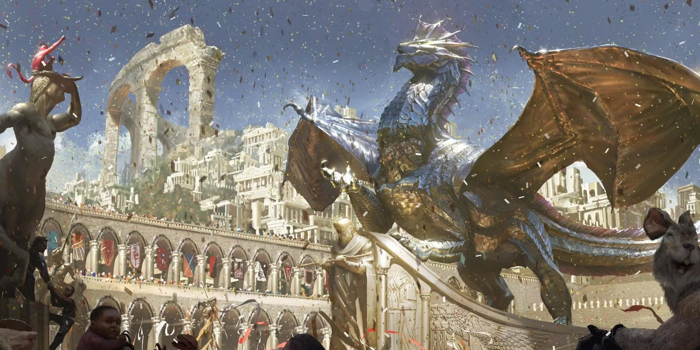

**Pronouns:** He/Him

Lionell, Bringer of Justice, Elder knight of the Brightstrider Dominon, Aspect of the Golden Light and Justice.

Aka Leader of the Brightstriders.

"Accompanied" by Volnescend, Grace of Kings, Last of the Dragonkind, shackled at the top of the Brightstrider HQ, under Lionell's absolute control. 

The party has learned that a special magic harness allows Lionell to control the elder dragon.

Lionell has been seen talking to mysterious starwielders, exchanging information.

> Lionell bringer of justice unleashing his full primordial power.

> Volnescend standing proud at a celebration in Aneridge.
