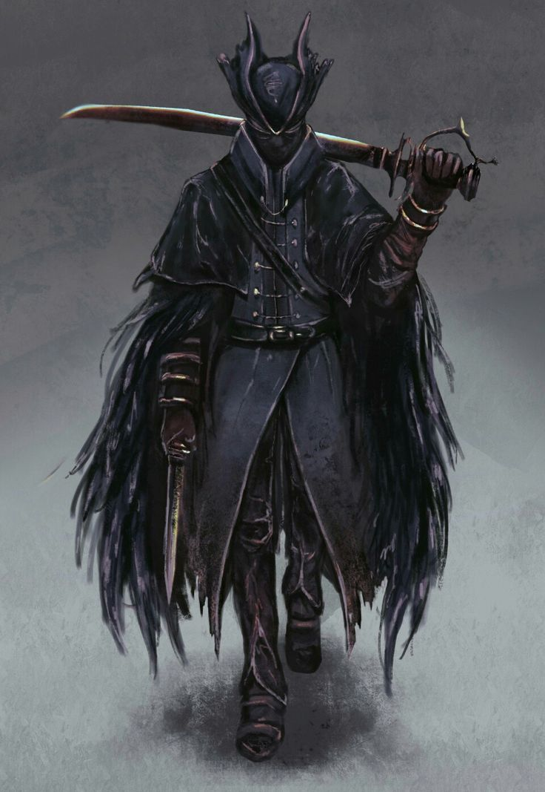

A tiefling girl was born with the name of Mavari, older sister to Ramira. They lost their parents early and began to lead a life in the Ramshorn area. They worked odd jobs and helped out, quickly becoming beloved by the local community. When Mavari was old enough she started diving into the deadly mines, searching for the precious indigo aurora. Once even Ramira, Mavari and Carmelio entered the mines together. Most of their team died but the three barely made it out. 

Early on she already showed distrust for Carmelio, the advanced automaton. After Carmelio destroyed their little village, Marrens Eve and killed many inhabitants with a explosion, the sisters make their way to to different, safer realms. Eventually they get recruited by the Brightstrider Dominion and finally gain access to education and safe beds. 

At some point Mavari was reborn as the Tor.

Tor, the first technomancer... of the Brightstrider dominion. We do not know what happened for her to join the dark knights. She seems to be the youngest of the group. 

