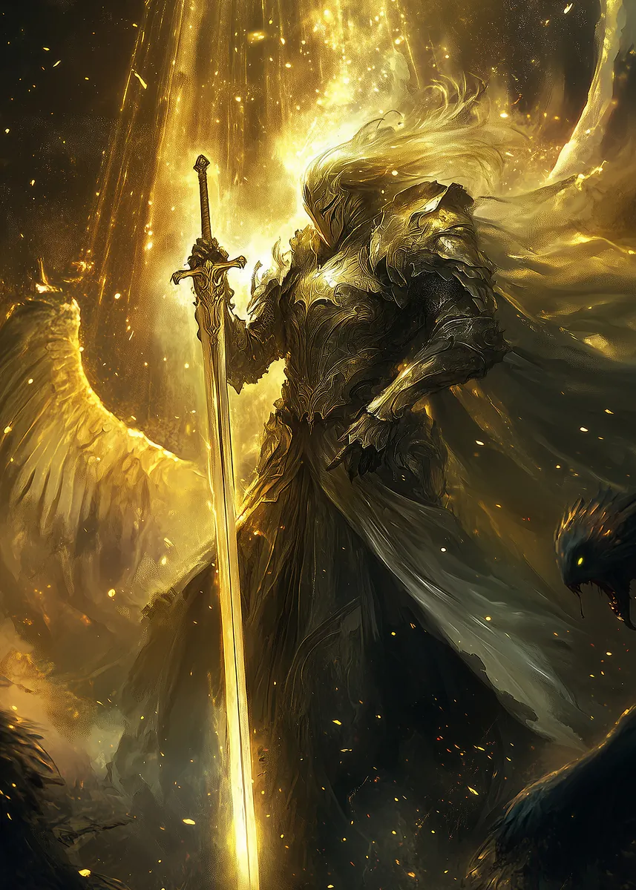

**Pronouns:** He/Him

Formerly a golden Knight and Aspect of Pride, now he is crippled lost adventurer trying to make ends meet. His journey eventually leads him to Menzo.

Had direct beef with Noon and tried to kill her.
Attacked Party session 14, as he sought something from Akira. Previously had acquired a relic relating to Akira's past, but Akira reclaimed it after a fight.
Akira also took his arm as retribution for the one he chopped off when she was but a girl.

Amidst the retreat he killed Carmelio, causing a large explosion.
He has lost his "manhood" after Arkus casted heat metal on his balls, perfectly dubbed the Takoyaki Move.
Has now fallen from grace and lost his powers, replaced by Zura, the New Pride.

He now resides in Menzo and is the bodyguard of Clara.

> Pascal-Felipe, a knight fallen from grace.
