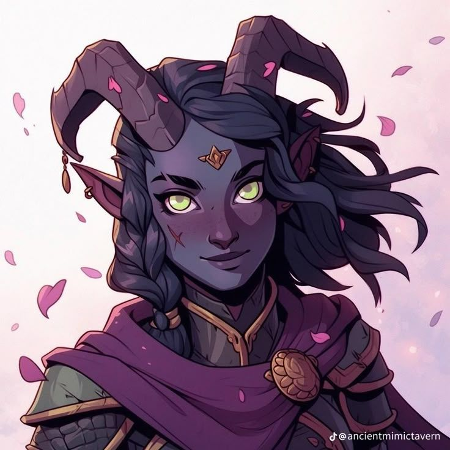

**Pronouns:** She/Her
Ramira "Reverance" Dakharos

A young blue tiefling girl living in Marren's Eve with her older sister Mavari. With no parent left she started helping around the small village alongside her sister.

She is Carmelio's friend and the one who gave him his current name. She has been described more often than not as a little ray of sunshine and a hopeful soul.
Once even Ramira, Mavari and Carmelio entered the mines together. Most of their team died but the three made it out alive.

She got injured during the explosion, a part of her horn breaking, becoming a keepsake and spellcasting focus for her older sister.

After the Marrens Eve incident she got recruited by the Brighststriders alongside Mavari. She then became a cleric of Taeyar with the ability to control automatons and sharing disgust at the idea of destroying them.
Has met party in Raphia and helped save Mask.
Has been seen again during the heist in the Brightstrider HQ.

> Ramira.
