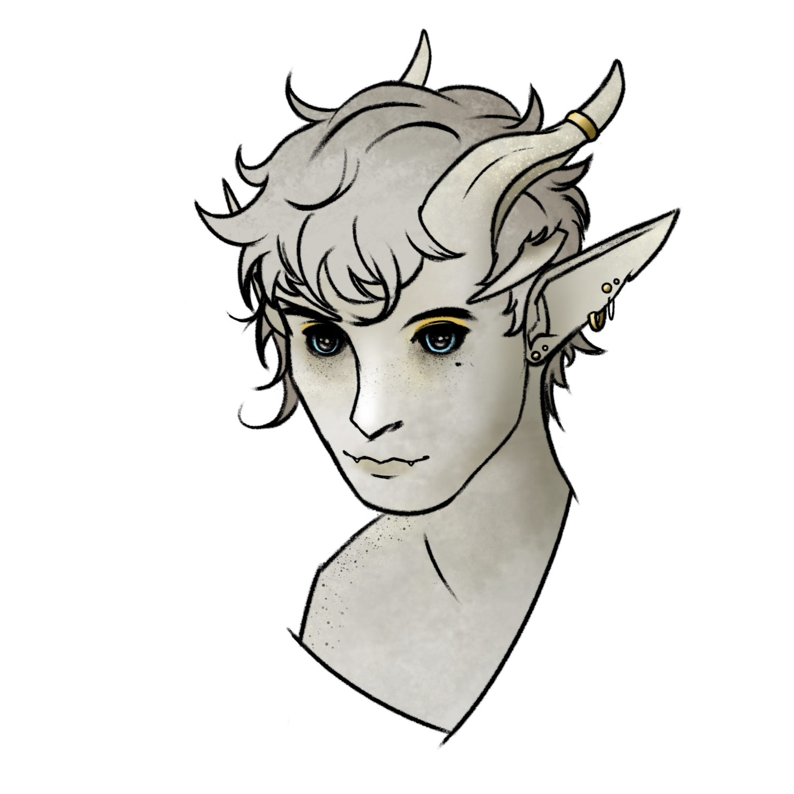

Arkus' roguish boyfriend.
A bone white tiefling who got freed from Raphia's prison.
While at first glance he appears quite unassuming, Ivory proved himself countless times to be both an indispensable ally and an incredibly reliable friend and support, especially for Arkus.
Armed with a custom dagger from Arkus own making he sweeps the enemies' backline with sharp precision and efficiency. Whenever shadows lurk, you can be sure neither your secrets and locks are safe from this tiefling full of surprises.

