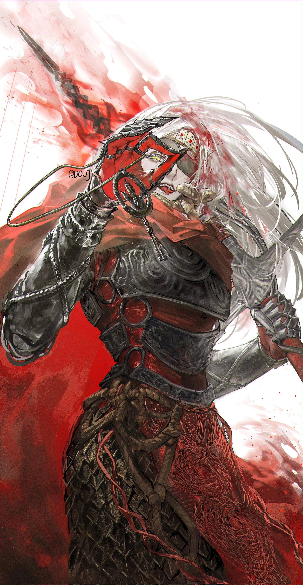

"Grant me your last words and I will want for nothing"

Necromancer and summoner of undead. Possess a powerful magical artifact, the Necronomicon.

Somehow has found the dead of Akira's tribe and has revived Akria's mom.

