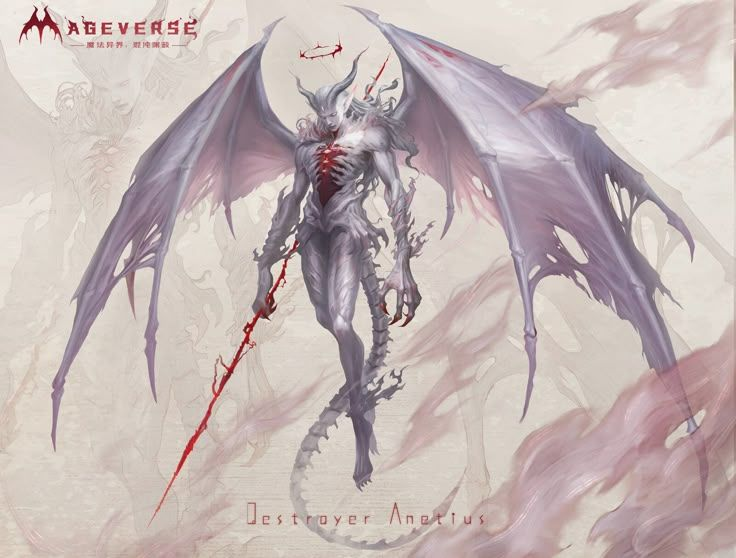

**Pronouns:** He/They/It

"Destroyer" of the Burning Legion.
 
A terrifying archdevil. The party met Anetius in session 32. Later in session 33 Merith stole a mysterious and powerful Orb from him, likely instrumental in the devils plan to betray the heroes and take control of the overworld. 

Later party learns this orb is a powerful blood orb capable of opening a portal to the hells. 

Is armed with a large brimstone spear that can tear the worse pain out of a being before killing it.
Has several eldritch eyes all over his body and a giant maw that can open on his chest.
Owns Kraz's soul and can cast his influence over him, but lately his infulence over Kraz has been weirdly tame. Has been banished back into the Hells thanks to the combined effort of the devils and Party.

