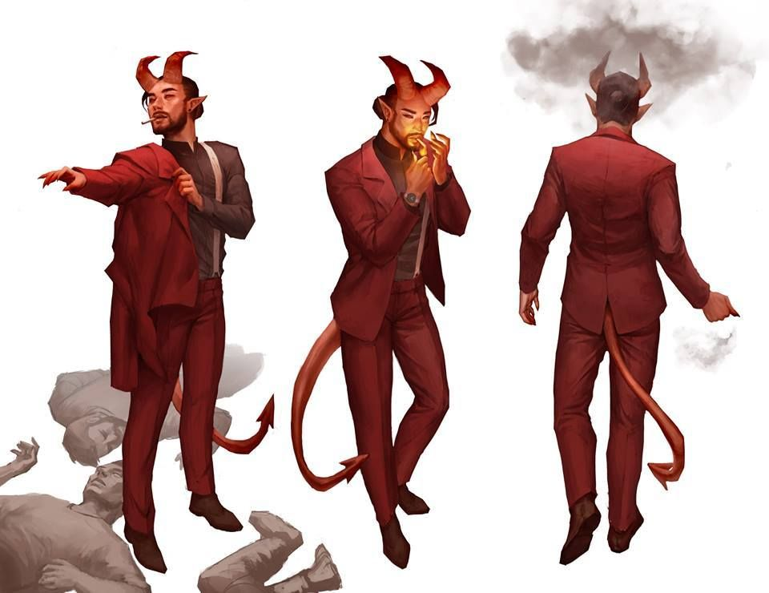

**Pronouns:** He/They/any

Kraz, a Succubus dubbed the troublemaker due to this unfortunate abiltiy to cause trouble wherever he goes.

Unemployed Devil and troublemaker of Obsidian. Has somehow ended up with party, doing things waaaaaay above his paygrade.
A shapeshifting succubus devil, Kraz has been seen of souls for a long while until he fed upon the souls Temper lost after a fight with Party.
His soul is owned by Anetius.
Has fought alongside Nazira and Naphim in the war of Menzo.
Has a complicated romantic past with Nazira.
Love interest of Nailo and Vhaeraun.

