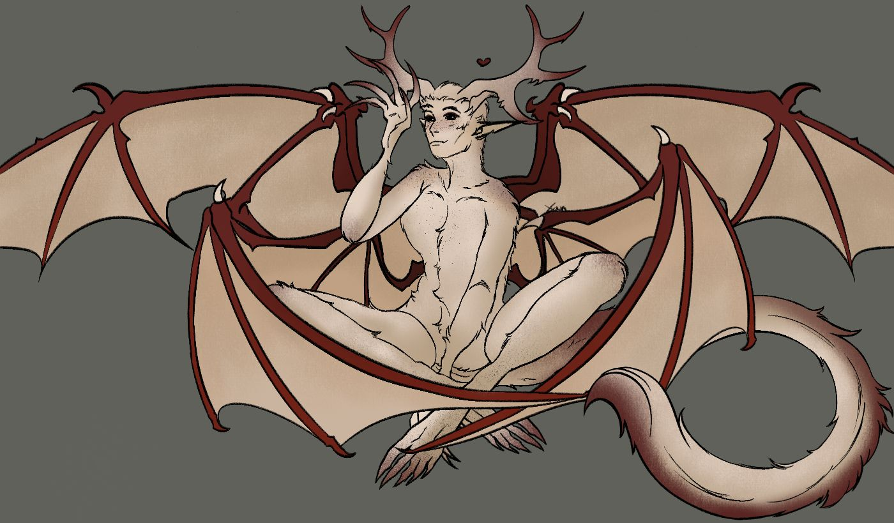

**Pronouns:** He/Him

Higher Devil that served as protector of Obsidian. He once fought alongside Nazira in the Bloodwar. A giant slender bone devil, a perfect soldier and a sweetheart.

He is now accompanying Party in their adventure alongside Nazira and Kraz and currently resides in Menzo. He lent his aid during the war of Menzo.

He uses his inner magic to strengthen his body with large antlers, long sharp claws, powerful wings and a stinger in combat. Normally he adorns a sturdy heat resistant shell allowing him to swim in lava. However due to the changes of temperature and weather at the surface he now has grown a thick layer of short fur to protect him.
His main diet consists of bones and various hellstones.

He has grown much closer to Carmelio after they saved each other during the incident in the caves of Penumbra.
Carmelio and Arnael's love interest.

