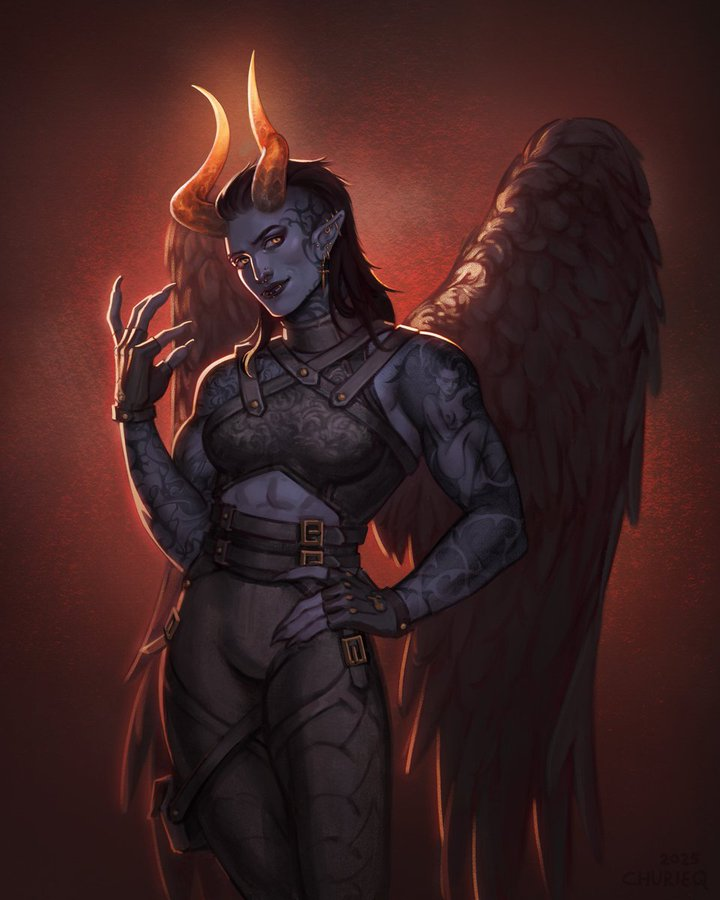

**Pronouns:** She/They

Captain of the Burning Legions, served under Urduk.
A powerful mage hunter. Has been seen interrogating a Archdemon, a Mystic.

She is now travelling alongside Party and lent her aid during the war in Menzo, where she now is currently residing.
She has made a pact with Nailo so that her, Naphim and Kraz remain safe within the city's walls.

She died during the incident in the caves of Penumbra only to be brought back in-extremis by Party's combined effort. She has lost a wing in the process and is currently resting in Menzo.
She has grown closer to Merith, Mask and Noon since then.

Had a past and seemingly complicated relationship with Kraz.

