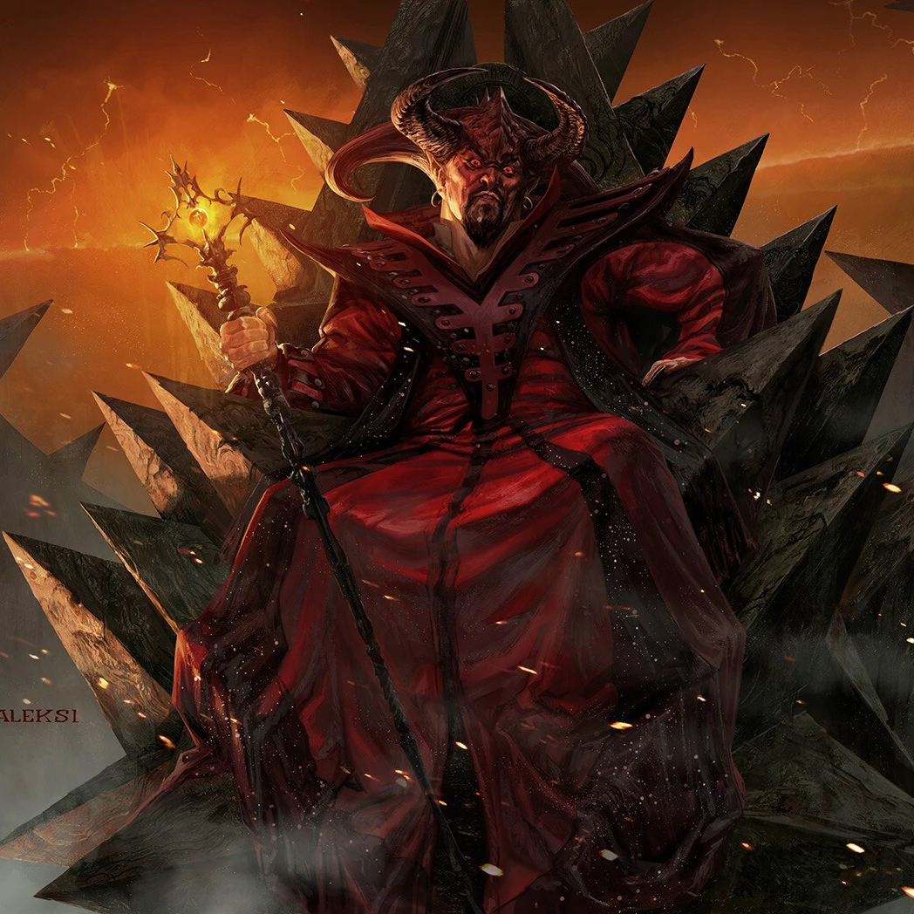

**Pronouns:** He/Him

General of the Burning Legions, driving force in the Bloodwar.

An Archdevil who cursed Mala and seems to have some deep rooted history with him.
Inhabits a reanimated Titan to wage war, using Infernal Soul Magic.

