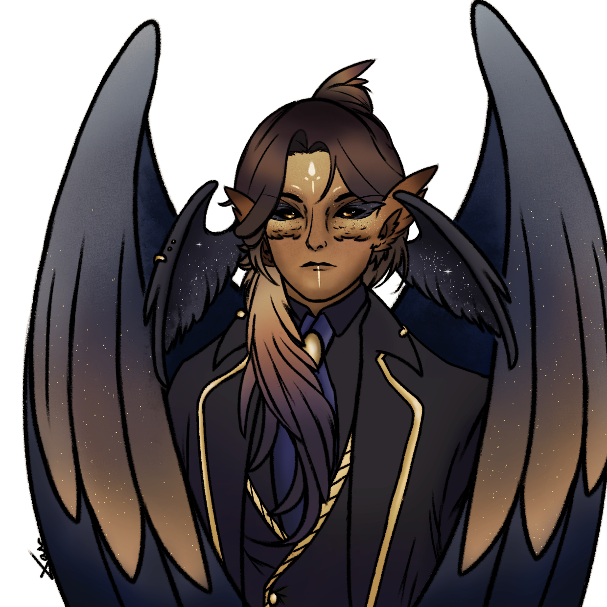

**Pronouns:** He/Him

A great owl from the feywild, who favours a fancy 3 piece suit, tailored to his unique form. Arneal is often considered an Owlin, but is part of a mostly forgotten race of giant Owls residing in the feywild. Therefore he does not have arms, but does posses the power of speech and the ability to weave the arcane.

Arneal is one of the few fey that prefer the mirrorworld over the feywild and that has a affinity for mortals. 

With wits as sharp as his claws he is both a formidable fighter and a resourceful informant.
He is the mysterious person that party met in Raphia session 11. Encountered at the Ai'Ruma ruins as Mask's contact he helped party gather various intel and eventually obtain curse wards from the witch Alecto. Utilizing an ancient artifact, forged by some unknown fey master smith, Arneal can enter his "nightmare form" increasing his size as shadows cling to his form. In this form the party can travel on his back.

To further describe his additional formes
- **Nightmare form** : a much larger and intimidating owl form mostly reserved for combat with pitch black feathers, glowing eyes and arcane patterns.
- **Owlin form** : a much smaller humanoid form only used when necessary as Arneal believes he should not hide who or what he is, not even in front of mortals who despise him.

Arneals ancient fey artifact is called "Hunters Trophy" and is a legendary claw gauntlet he usually wears on his right claw.

He is one of Carmelio's love interests alongside Naphim.
Has grown considerably closer to both.

> Artwork created by our very own Xan, an reimagined illustration as Arneal in a more humanoid form.
