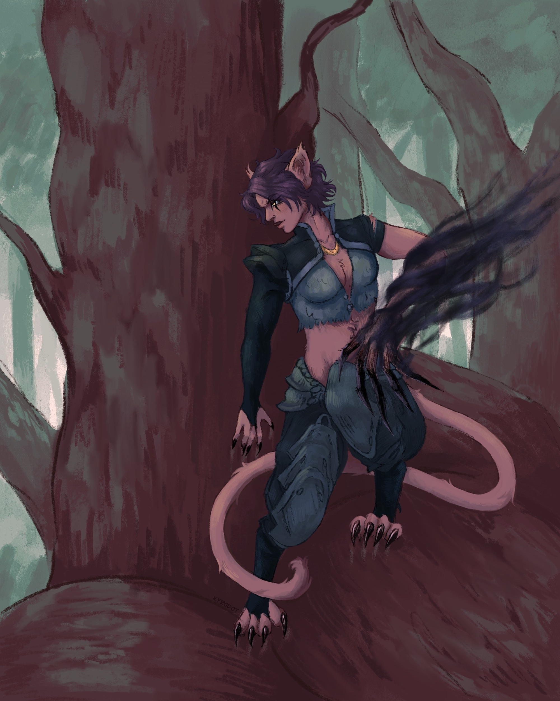
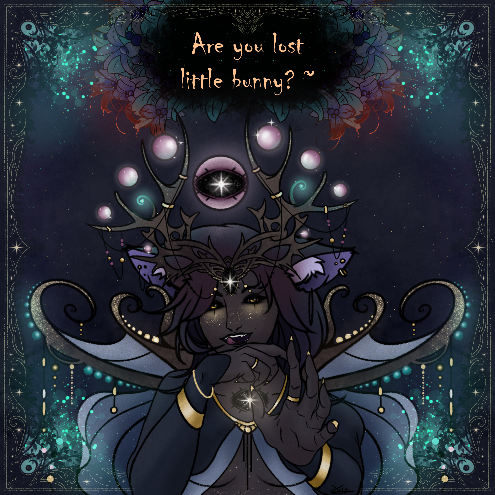

**Pronouns:** She/Her

Faena is the daughter of two first fey, Father Hunt and Mother Nature. Both of have perished as Aliana burned the Emerald grove. 
Aliana herself saved Faena from the same fate that befell her parents. Prior to the burning of the emerald grove Faena considered Aliana family and a sister, using the nickname 'Al' for her.

>"She has often been called godess of the hunt, of course she is no real god. No primordial energy flows through her, however if anything or anyone in her vicinity flees, she will without fail take up the hunt and she will kill her prey. It is a law as old as gravity

>... Its simply best not to run when she is around, just to be sure."

| *Quote from someone that survived an Encounter with daughter Hunt.*

The still young Faena was then raised by Alecto, a witch. Alecto is by no means a good parent and has often treated Faena very harshly.

Faena is not afforded much respect in the community of the fey and struggles to find her own path. Early on Faena met a shapeshifter, Merith, who showed the young hunter kindness and warmth. The two quickly feel in love and have been partners until recently atop the Aneridge Citadel, where Faena left, despite Merith pleading for her to stay and reconsider.  

She has the powers of both nature and the hunt within her, but is only able to access the hunts abilities. 
Can weave dangerous shadows to sharpen her claws and hunt down her preys mercilessly.

"Nature VS Nurture" further explores the relationship and story of Aliana and Faena.
"First Impressions" explores the first meeting of Faena and Merith.

She has now joined the Nameless Kings army, as his right hand, earning the title "General Hunt".

> Artwork created by our very own Kyrodot, Faena on the hunt, after industrialized armor has become more common. Here she is stalking some unaware prey. Her left hand is imbued with the power of the hunt, manifesting in dark wisp as her claws grow unnaturally long and sharp.

> Artwork created by our very own Xan, Faena wearing a ritual crown.
