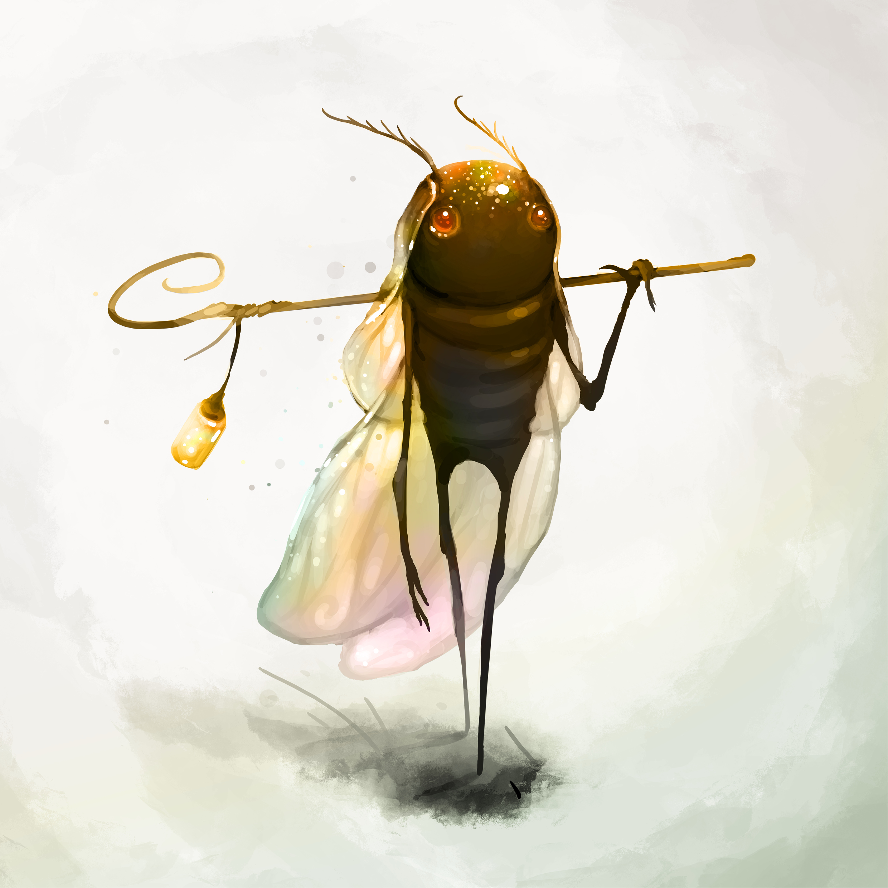

**Pronouns:** He/It

A Sunchaser moth that landed in Sasha's hair in the dust well and who was graciously brought to the surface where he could escape the iron dust. In the meantime he taught Sasha about fey-Alchemy and bestowed his Alchemists Gamut upon him. Sasha gifted his former name to Gawaine, who wears it proudly ever since.

