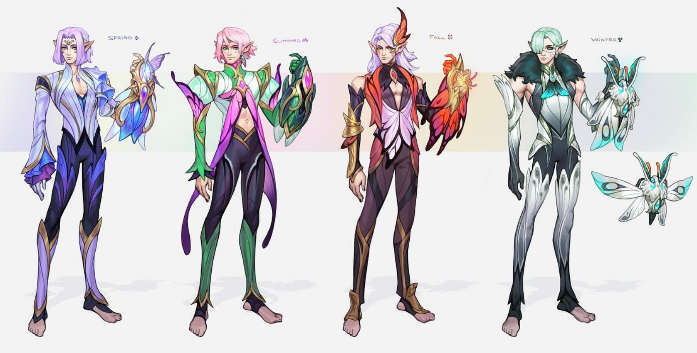

**Pronouns:** He/Him

Teacher, supervisor and librarian, Malachi is a dashing yet cunning fairy who took Aaron under his wing and seems greatly interested in both him and Rêverie.
He has taught Aaron dream magic.
He shares a similar sentiment of rebellion against the Nameless King and silently works in the shadows helping Aaron and Rêverie to the best of his abilities.
Is a love interest of Reverie and Aaron.

> Malachi in his different forms, based on the four seasons
