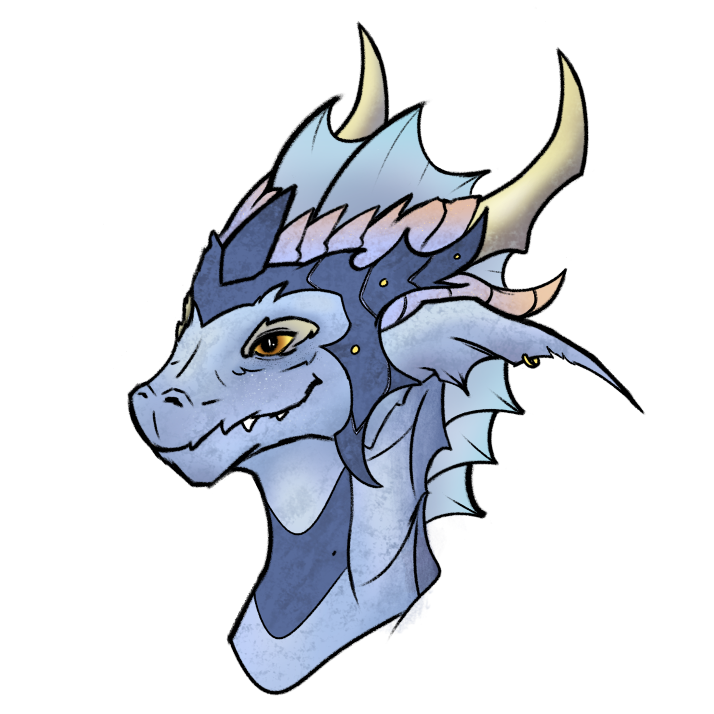

**Pronouns:** She/They

A shapeshifter and ex partner of Faena.
Currently looking like a blue dragonborn lady, her right arm is a mechanical wonder.

Initially appeared as the Ivory Might, a General of the Ivory dominion. She is the one who attacked and killed Mask in session 9.
Following a fight and a loss against Guldor she decided to follow Party, lending her strength and knowledge this time. Although she remains a slippery lone shadow at times.

Has grown closer to Mask, Noon and Nazira.

> Artwork created by our very own Xan, a headshot of Merith in her blue dragonborn form
