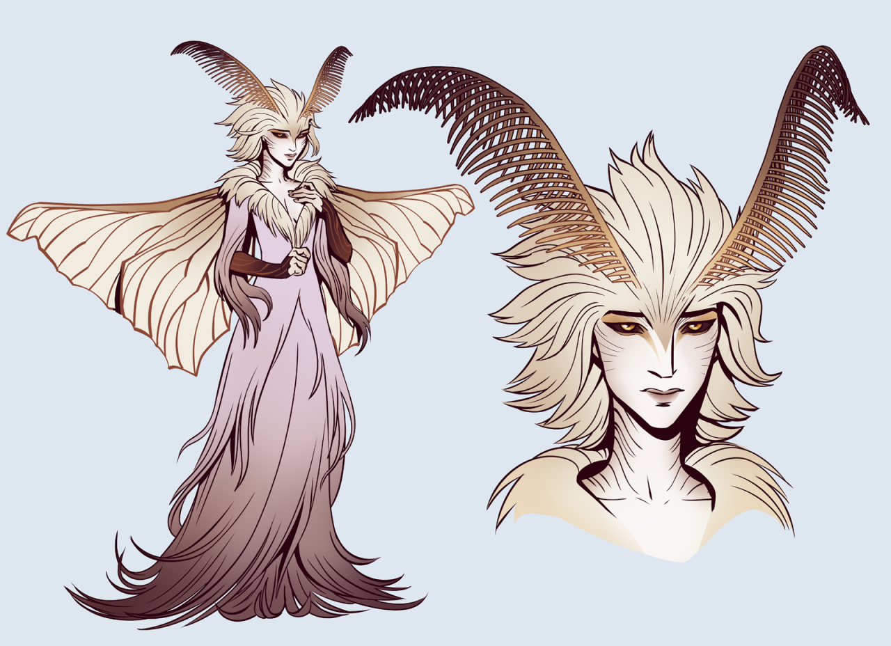

**Pronouns:** She/Her

Last seen residing in the caves below Ai´Ruma. Moffolistril is building an army of giant scrap automatons that possess the ability to transform, in order to invade Raphia to eliminate the careless progress that pervades the region.

As so often the fey show us what magic is truly capable of, so has Moffolistril shown unprecedented magic in controlling automatons fully and completely. A new kind of magic? Technomancy?
Seems to have escaped the mages' attack on the settlement unlike her partner Vanulloth.

