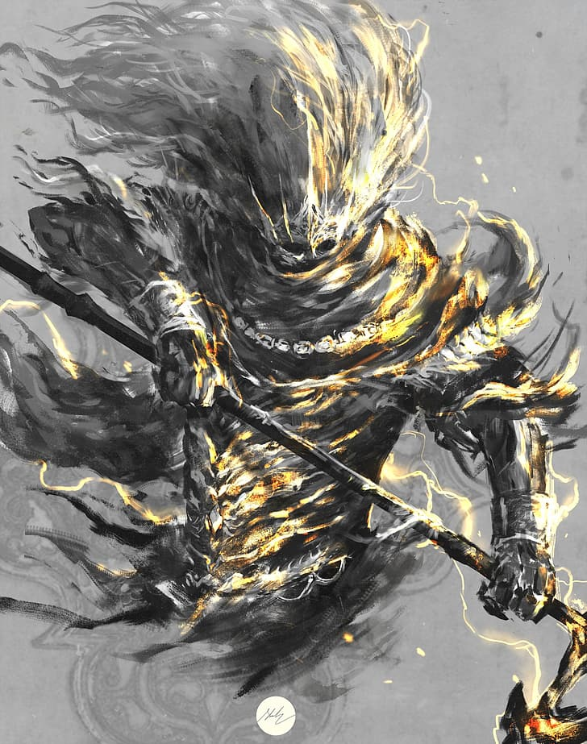

**Pronouns:** Any

A first and perhaps one of the most powerful fey. They seem to harbor a storm inside of a mighty armor.

They rose to power after the burning of the Emerald Grove and launched an attack on Ai'Ruma during the Golden Age of Humanity. In the ensuing fight they shattered Aliana in an attempt to extinguish the flame of ambition, but it burned bright in many a mortals heart.

After these events the Nameless King gathered the most powerful fey to create the Mirrorplane resulting also in the creation of the Mirrorworld, giving mortality a second chance at life.

They are now gathering their forces near the barrier that separates the two planes, ready to punish mortality again for they have transcressed. A third chance will not be given.

They are the one who plunged the Mirrorworld into eternal night, eclipsing the Sun in an attempt to weaken and Aliana, the Spark, as the Nameless King calls her, who erected the barrier.

