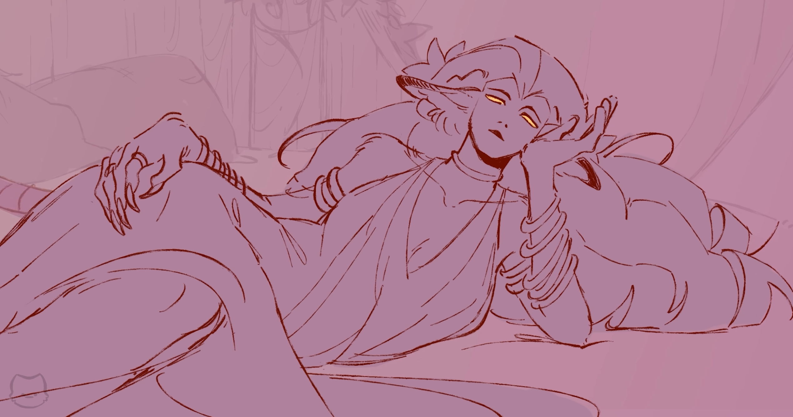
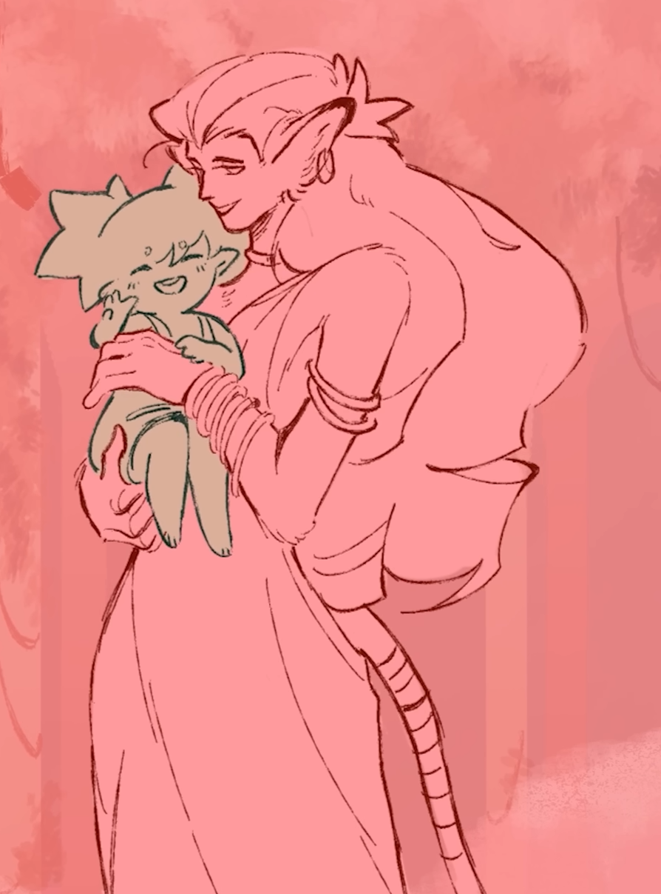

**Pronouns:** She/They

A first fey and Faena's Mother. A kind, loving, patient and nurturing individual, whose thorns aren't to be underestimated nonetheless.
Was once close to Aliana and considered her her own daughter.

Their relationship progressively fractured as Aliana started defying the laws of Nature. Nokomis eventually died as the Emerald Grove burned.
She perished in the flames while trying to protect her people one last time, saying "It is simply in my nature"

> Nokomis on a bed, her bestial features and her vast beauty on display

> Nokomis holding a very young Faena

