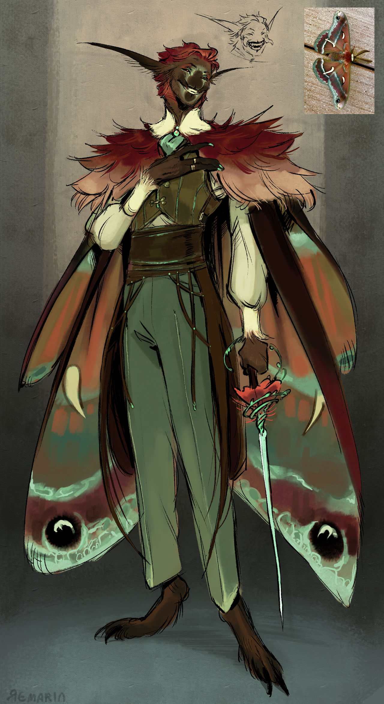

**Pronouns:** He/They

Moth Fey and partner to Moffolistril

The mysterious rapier wielding partner to Moffolistril, showing a rare affection for mortals, at least rare amongst fey.
Has been found prisoner in the Study Grounds alongside countless other feys of various calibre and age.

