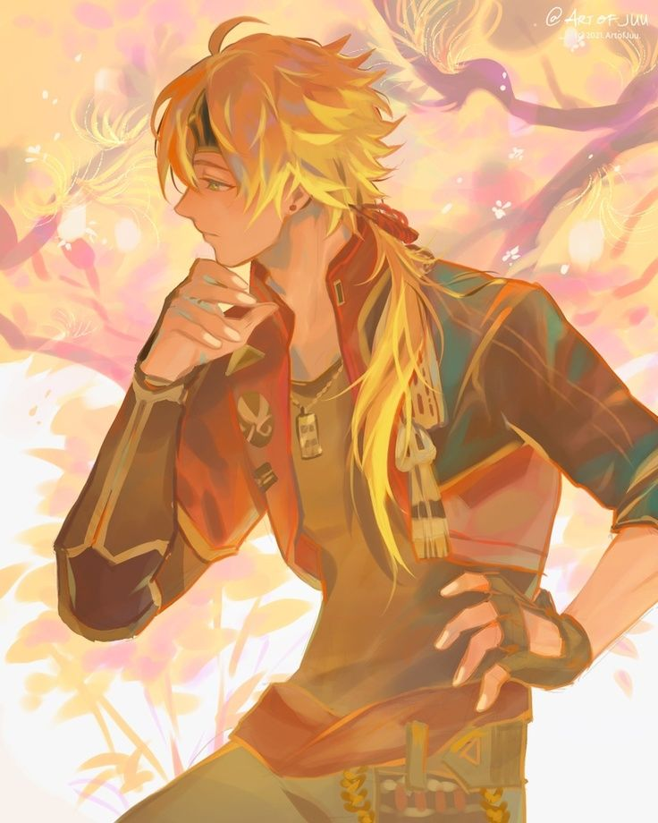

**Pronouns:** He/Him

Knight of the Ivory Dominion.

Ambassador and socialite, one of the many 'problem solvers' of the dominion.

He has met Arkus in Aneridge's prisons and admitted knowing and helping Tanyll for a little while. 
Rumours say that there is more than just friendship between those two.
Despite the suspicions from Party and Arkus specifically, Dorchiot has been rescued from the prisons too and is now still actively helping Tanyll both for his treatment as well as extracting him from Raphia. Their current location is unknown.

