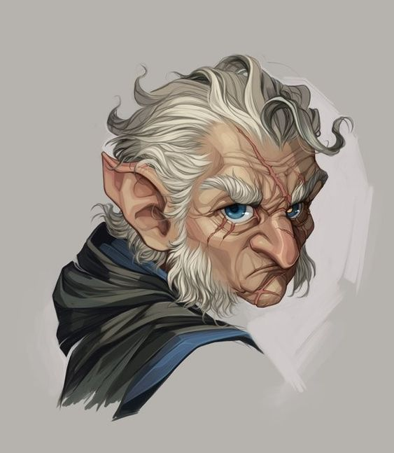

**Pronouns:** He/Him

Sergeant of the Ivory Dominion.

A cruel and ruthless halfling who supervised the mining operations in Marrens Eve. Countless miners lost their life in the mines indirectly by his hand.
He has met Carmelio early on in his adventure when the latter has been sold to him as a valuable asset.
The Marrens Eve incident happened following an altercation between Carmelio and the sisters against Finkas and his guards. Finkas ended up gravely injured by the explosion but survived.

He met and tried to arrest Party in Raphia soon after they brought Mask back to life during session 10.

