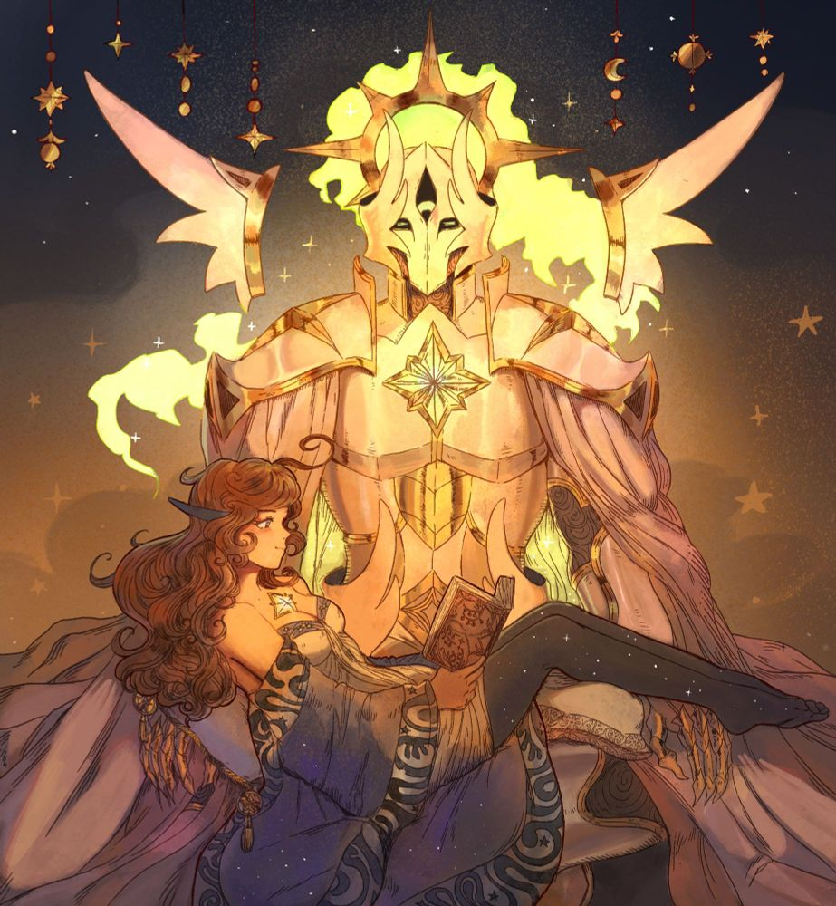

**Pronouns:** She/Her

Also known as General Paragon.

A prodigy Artificer and one of the lead figures in the mechanical revolution. She is always accompanied by her Golden Warden, a highly advanced Automaton that is somehow controlled by Miria. Miria carries a Arcane Reclaimer that somehow can extract the arcane from creatures and the surrounding area, which she uses to fight.

She has encountered and fought half of Party and Faena in Aneridge during session 22
She encountered Party momentarily at the crossroads when departing for Athenaum in session 45. She remained suspicious of Carmelio, not recognising his specific model.

> Miria being held by her Golden Warden.