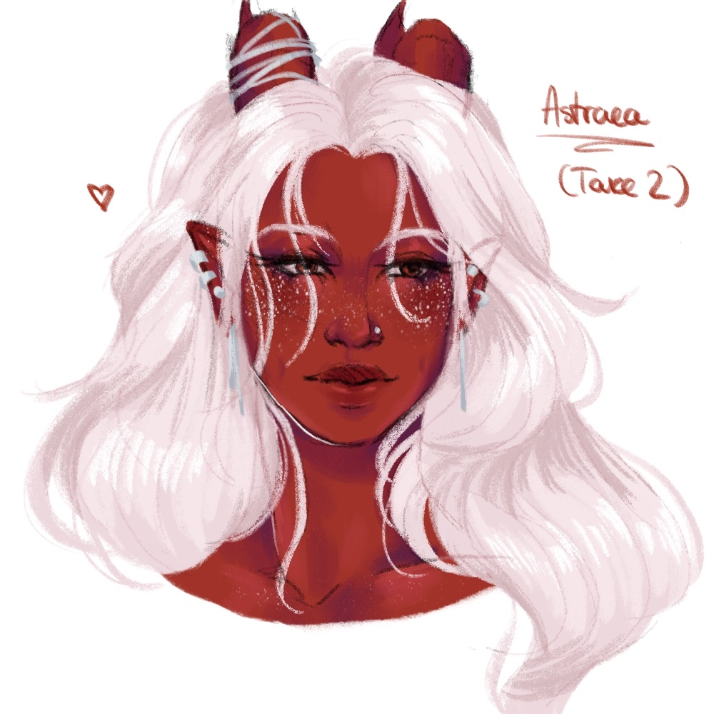

**Pronouns:** She/Her

Taking after her mother, Astraea has already shown a great aptitude for the arcane. The 19 year old red tiefling follows her mother into the field to continue her studies as well as to apply what she has learned.
She accompanied Party in the caves of Penumbra and almost got buried during the incident alongside the others.

