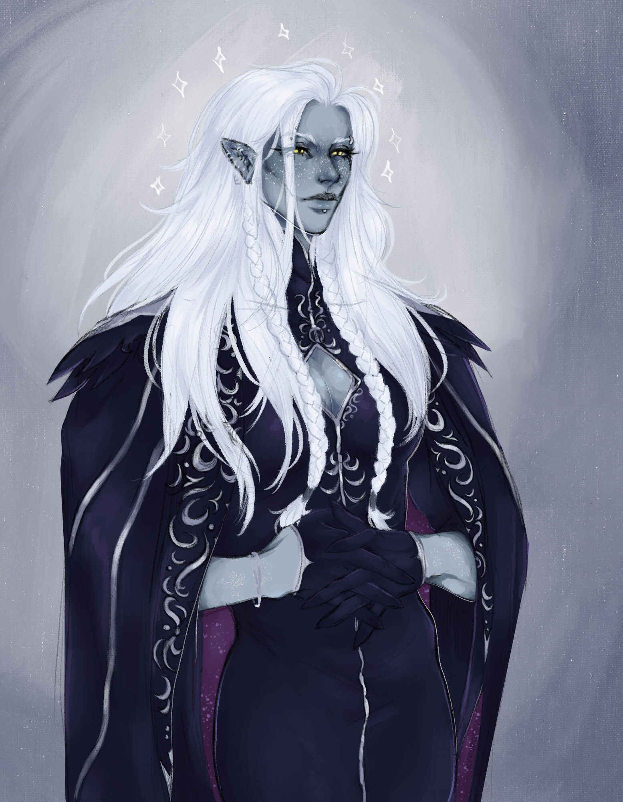

**Pronouns:** He/Him

Primordial Mage and King of Penumbra. A well respected leader, a well versed socialite with a cunning eye and a powerful adversary in battle. Mel has fought his way to the top and has brought Penumbra into a state of relative wealth... until his son was tricked and the Brightstriders took hold in the underground.

Has helped Party saving Nazira after the incident in the caves of Penumbra.

