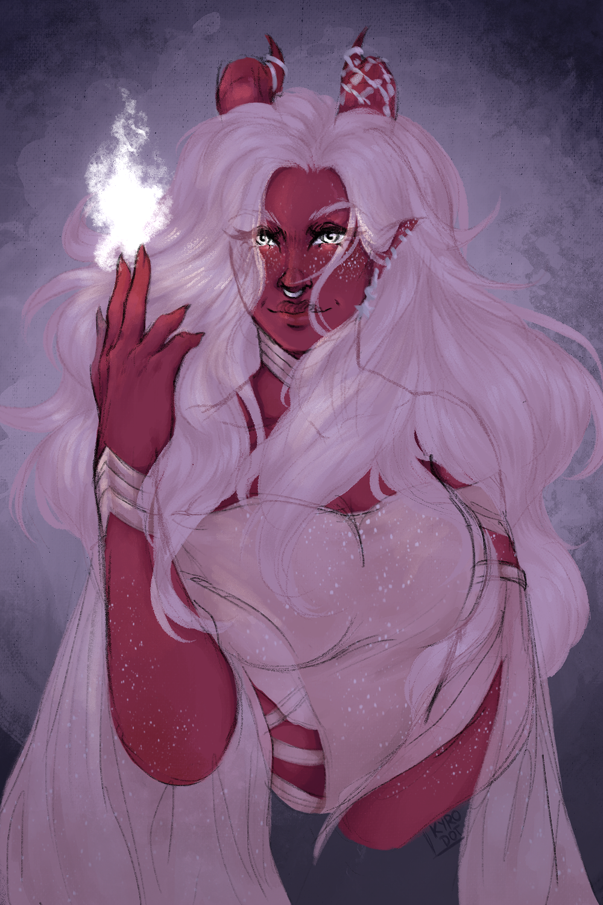

**Pronouns:** She/Her

A well known and beloved red tiefling warlock. Considered to be the most powerful wielder of the arcane within Penumbra and wife to the quad(tm).

Her divination services are heavily sought after among Party as she has helped many already. She also serves as a wonderful honorary therapist.

She is part of the elusive group only known as the Watchers.

