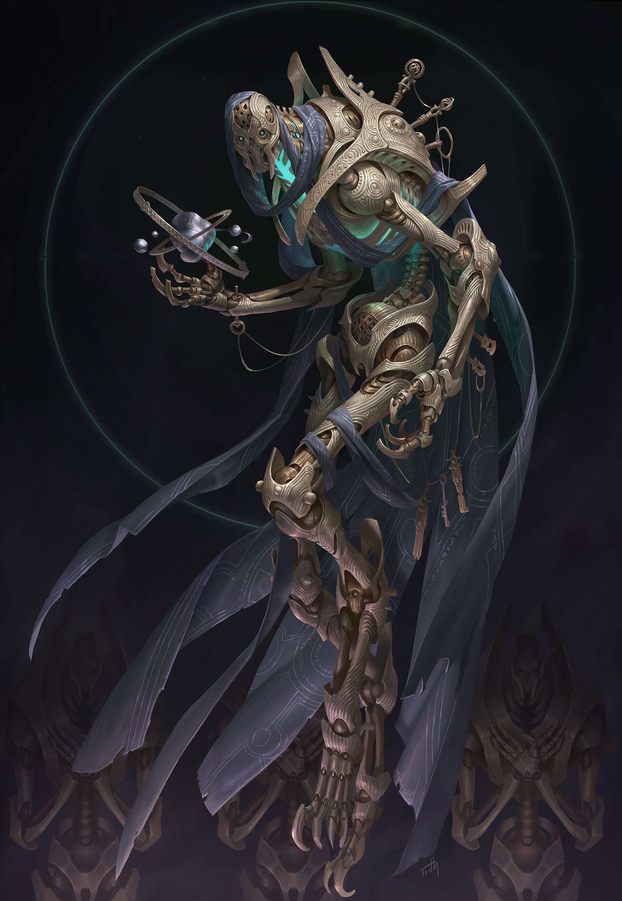
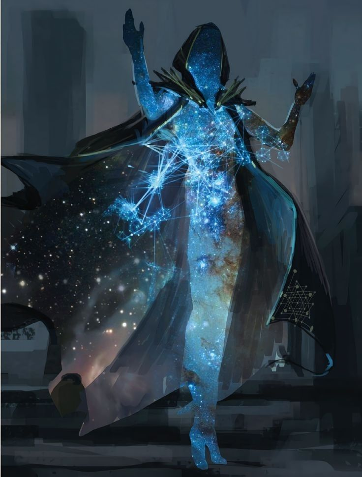

Founder of the Starwielder Dominion, and still part of the Starwielders.

Alianas life is further detailed in Nature vs Nurture.

Lived and heralded the golden age of humanity and the golden age of humanity. 
Eventually got killed by the Nameless King. 

Aliana has in her previous life attained immortality, by yet unknown means.  
Her soul was split into seven pieces, all of them brought back into this world.. one way or another.
Namley the Homomachina Perfectus Project has delivered her many of her current vessels. 

Aliana mostly resides in Athenaeum, the new captial of the Starwielders, as Ai'ruma is in the Ivory dominions control.

Her soul is split into 7 pieces.
1. The Soul: Carmelio
2. The Brain: Robot
3. The Heart: Robot
4. The Body: Homunculus
5. The Voice: Robot
6. The Might : Robot
7. The Wrath : Robot

In her previous life she was in love with the Observer.

Aliana takes on many forms. Should you encounter her in the Sea of Knowledge you will see this. 
