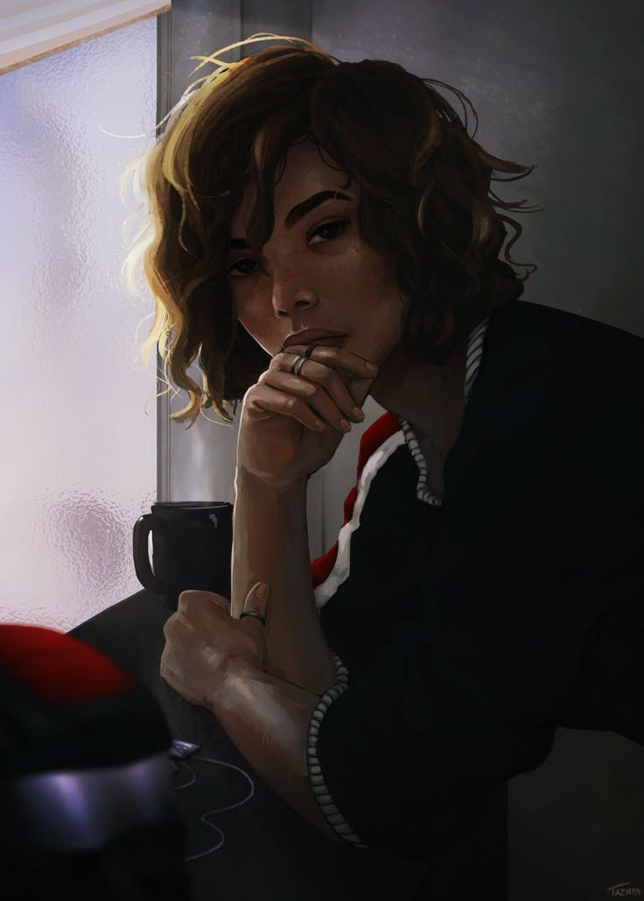

**Pronouns:** (She/Her)

Starwielder Mage. Artificer Extraordinare. Metalwork Master.

Part of the Ornata Homomachina project, tasked with the development of the automaton shells. 

A lone wolf and close friend of Percival. After the Ornata Homomachina events she grew a bit more erratic and couldn't come back into the rhythm of the Starwielder Dominion. She then went on to work on her own projects.

She offered the following emotions to Carmelio : Passion, Calmness, Anticipation, Pride

