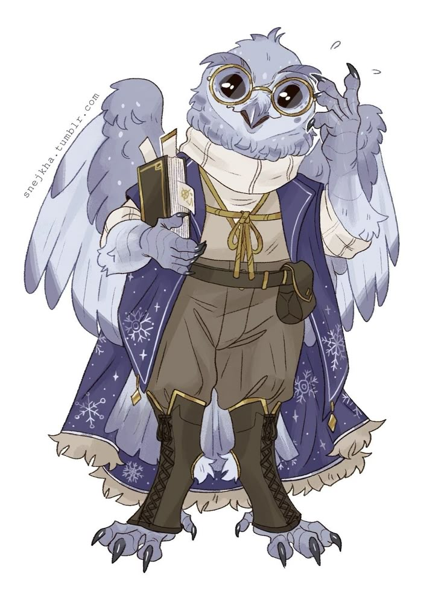

**Pronouns:** (He/they)

Starwielder mage and talented book-keeper.
Also known as "Web".

Part of the Ornata Homomachina project.
An owlin secretary, involved with the secret project of the Study Grounds.

He is the mysterious contact of Reverie's parents "Web" and the admin of the fey prison.
For unknown reasons he seems to have complicated emotions regarding Carmelio. Seemingly caring yet never showed up in front of him. After the events of Ornata Homomachina he returned to the Starwielders and started climbing the ranks. For a while little was known about him, but recently he has become more active again.

He offered the following emotions to Carmelio : Disgust, Contentment, Doubt, Shame

