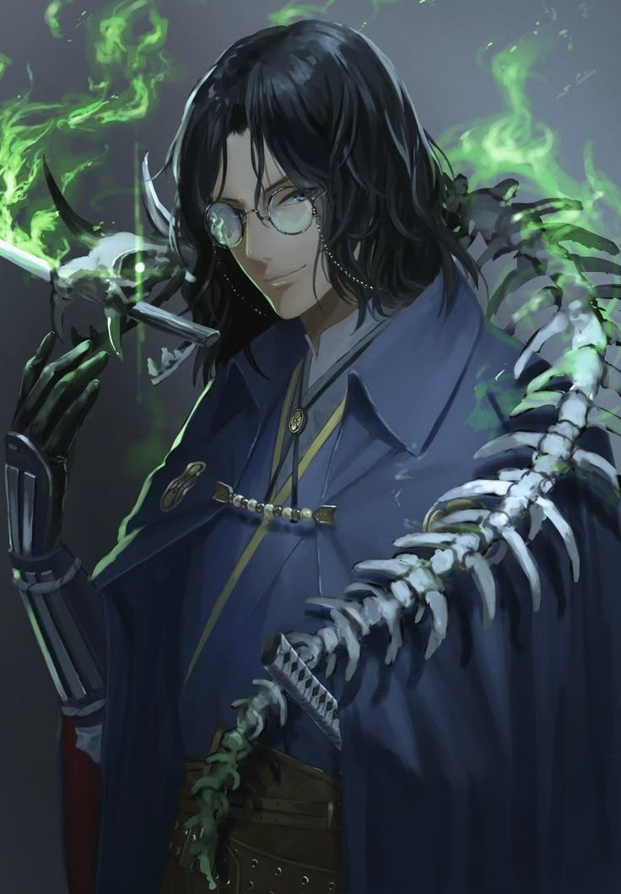

**Pronouns:** (they/them)

Starwielder mage, Occult-Expert and a Warlock.
Part of the Ornata Homomachina project.

He specialises in the occult. Completely vanished after the events of Ornata Homomachina.
Once a good friend of Percival and contact of Arnael. He has changed alot and the relationship turned sour. He is now a figure to be careful of.

He offered the following emotions to Carmelio : Fear, Awe, Surprise, Frustration

