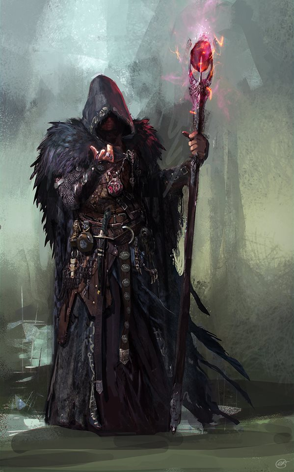

Dean of Tranmutations, master of many forms and the Ravenmage is hard to pin down. A particular black raven may appear wherever history is being written, heralding the arrival of Medivh. His true motives are yet unknown, but he treats the world mostly as an quiet observer.

