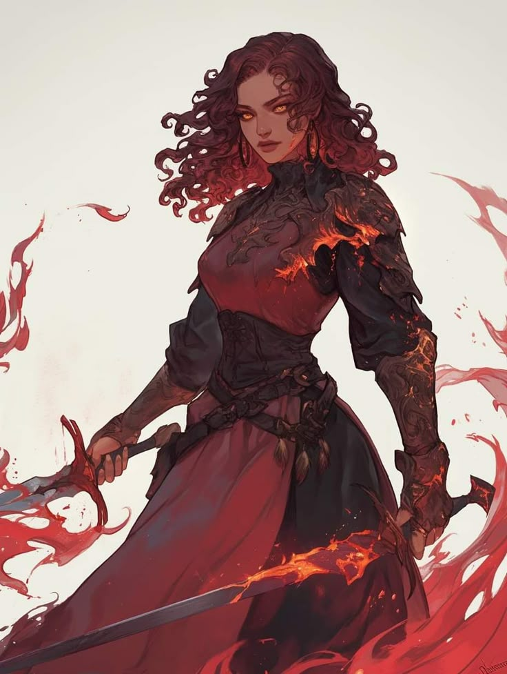

Nova is widely regarded as the Duelist Mage. Her combination of classical warfare techniques, weapon styles and the arcane is unique as it is deadly... and only taught in her own academy. Despite Novas temper and her young age she is widely respected by the other deans. 

