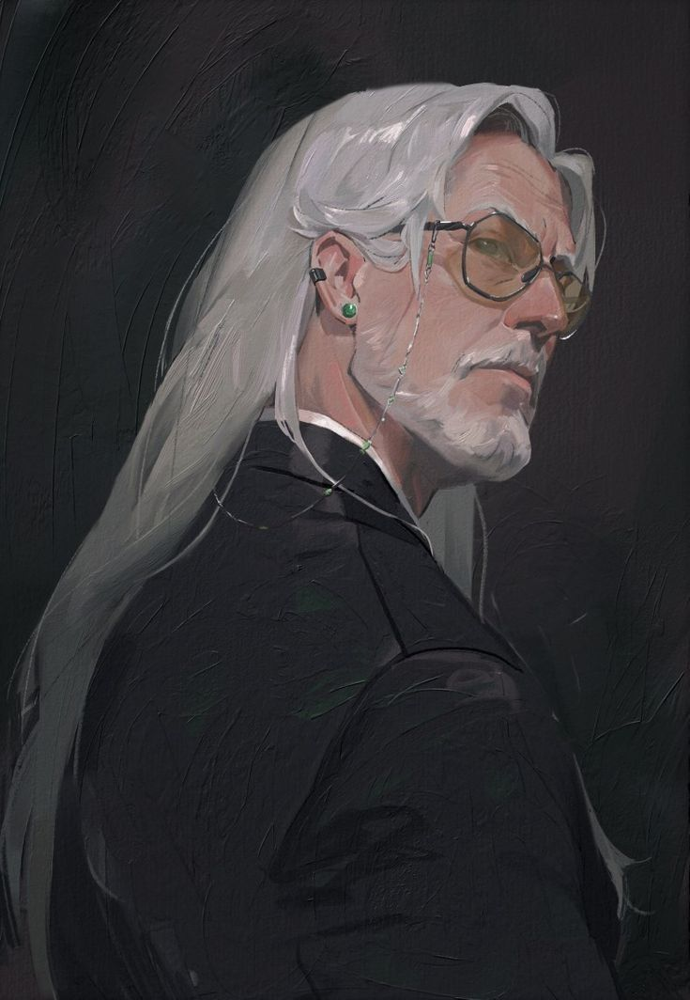
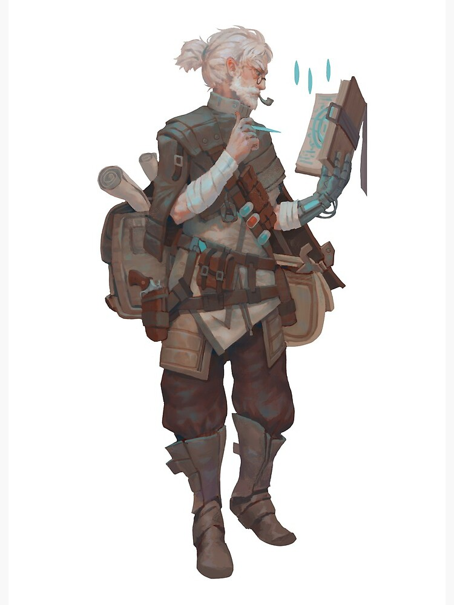

**Race :** Human 
**Sex** : male
**Age** : 63
**Pronouns** : He/they
**Occupation** : Archmage/Inventor, Carmelio’s father, Leader of Ornata Homomachina Project

Percival has done what no one else since Aliana has accomplished, he established a new school of magic. Very few students study the arcane side of technomancy, but soon that following might increase and he could command a academy of his own. Currently is considered an outcast of the Starwielders. 

## Ornata Homomachina
Lead the Ornata Homomachina project and worked alongside Ana Mechalistus, Edwin Strongfern, Flynster Blightwing and Zephyr Crestfyre.

The projects initial goal was to create a body to serve as a vessel for Alianas reincarnation, but this project ultimately failed, but instead Carmelio was 'born'.

