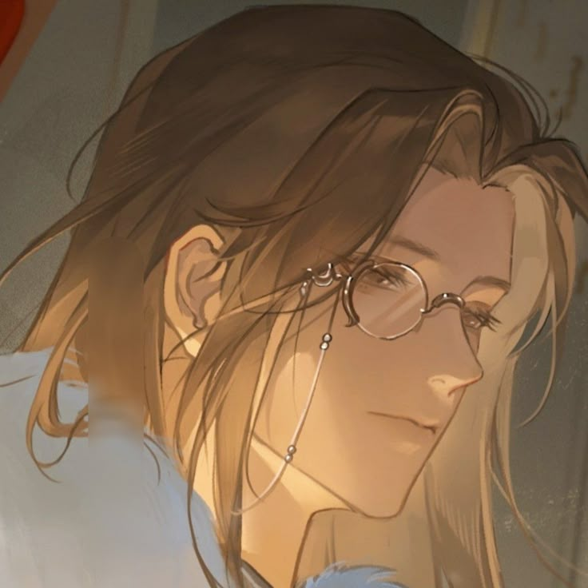

**Pronouns:** (She/they)

Part of the Ornata Homomachina project.

Carmelio's mother figure and personal teacher. A fairy.

After the events she went on teaching in Hevasaet academy, one of her students being Sasha.

She offered the following emotions to Carmelio : Happiness, Anger, Anxiety, Sadness, Excitement

