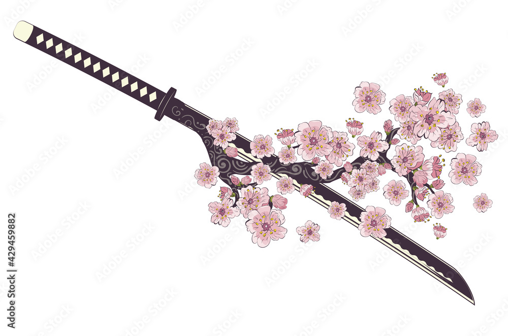

*Legendary, Longsword (requires attunement by a soulbound individual)*

**Stage 1:** +1 to attacks and damage throws. 

**Branching out.** This blade allows the wielder to sprout sharp roots from the blade and make a melee attack against a target within 30 feet. 

**Deadly Bloom.** If an enemy dies within 1 minute after taking damage from this weapon they immediately turn into a cherry blossom. Enemies within 30 feet of a cherry blossom created this way have the poisoned condition.

**Stage 2:** +2 to attacks and damage throws. 

**Binding strike.** When you hit with an melee attack you may expend an Bonus Action, if you do the enemy must succeed on a Strength Saving throw or be grappled. The enemy may retry the saving throw if they expend an action on their turn.

**Branching strikes.** If you hit with an attack you may expend a Bonus Action to make an extra attack against an enemy within 5 feet of the original target.

**Stage 3:** +3 to attacks and damage throws. 

**Bloom of Light** As an Action you may embed this blade into the ground. The blade itself will grow into a tree of light. All enemies within 60 feet have disadvantage on attack rolls, while allies have advantage on attack rolls and saving throws. You can retrieve the blade with an action, the tree will wilt.

