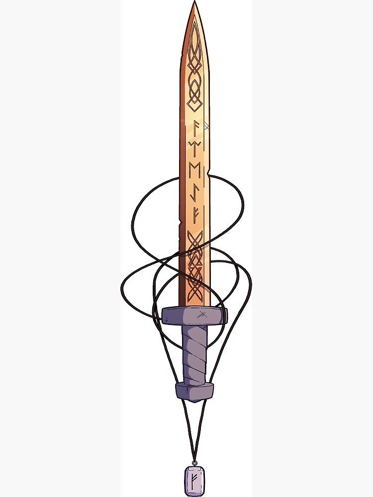

Summer Afternoons Namesword forged by Guldor and bestowed upon Noon as she reached the rank of paladin. 

This Sword of slowly adjusts to the season/climate the wielder is currently in, in small ways. The metal might change color and leaves may grow or ice may form on it.

**1st Stage:** +1 to Attack and Damage Rolls

Once per day you may stick the sword into the ground to create a mote. This mote may take the forms: Fall(Decay), Winter(Everfrost), Summer(Fire), Spring(Life). This will change the terrain in a half mile radius around the mote to fit the chosen season. The wielder may choose for this terrain to be difficult terrain. While wielding this sword you ignore difficult terrain create by your own motes.

**2nd Stage:** +2 to Attack and Damage Rolls

You gain additional effects for fighting in your own motes.

*Winter:* You may use your Channel Divinity for free once in this mote. Whenever you are hit the attacker take CHARISMA damage. 

*Spring:* You regain 1d8 life at the start of every round. If you are full Life gain 1d8 temp HP instead.

*Fall:* If you hit an enemy with this blade you deal an additional 1d4 necrotic damage and heal for the same amount.

*Summer:* Every attack with this blade deals an additional 1d8 Fire damage. 

**3rd Stage:** +3 to Attack and Damage Rolls

You can use Divine Smite for free once per short rest as if you were expending the highest spellslot available to you. 

