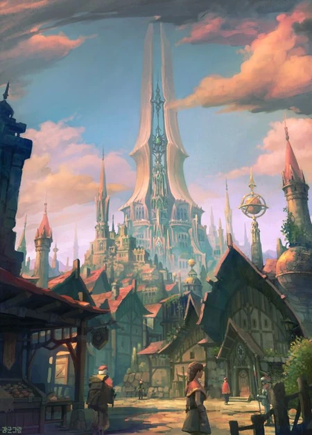

Home of the Brighstrider Dominion.

The Aneridge Scourge tore through this place roughly a century ago.

Is located right next to Vrocmore and harbors the elders of the Brightstrider dominion.

### Structure of the city:
- Outer Ring
- The Bridges
- The Inner Ring
- Citadel
    - The Upper Wards
    - The Golden Nests
    - The Eye of light

#### The Outer Ring
Anyone can find shelter in the outer ring. Some call this place peaceful, some call it dangerous due to the lesser regulations and security checks. 

#### The Bridges
The bridges are build across a mote separating the inner and the outer ring. Each bridge is fortified and guarded around the clock by brightstriders. 

#### The Inner Ring
Only citizen with documentation are allowed to enter the inner ring. The majority of artisans, traders and middle to high class citizen reside here. 

#### The Citadel
The citadel is the pride of the brighstrider dominion. It is located in the inner ring and contains the upper wards, the golden nests and the eye of light.
Only officials and brightstriders are allowed to enter, with the upper levels of the citadel being more and more exclusive. 

##### The Upper Wards
The upper wards contain officials, banks and politicians. This is the highest a non-brighstrider city offical can go.

##### The Golden Nests
Golden Towers adorne the side of the citadel, harboring the many griffins used by the brightstriders while patrolling the city. 

##### The Eye of Light
At the very top of the citadel sits the final defense and the brighstriders magnum opus: the eye of light. A powerful magical weapon powered by the 6 warden dragon eggs, magic is siphoned from their god-like souls forever keeping the dragons from reanimating.

Note: the 6 warden dragon eggs were taken during the ivory legions siege on Aneridge. 

