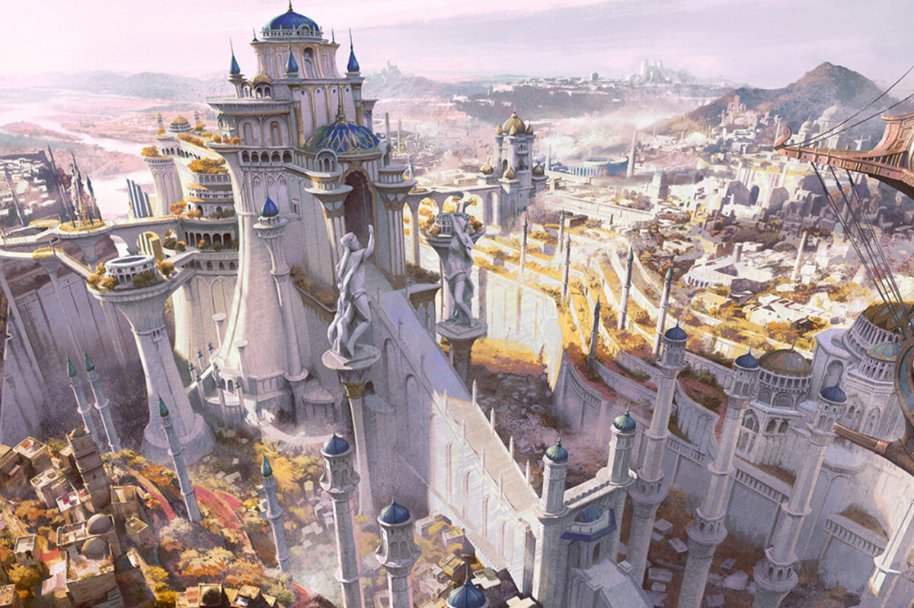

- harbors the most prestigious and powerful Academy called **Seriara** overseen by the Starwielder Dominion
- Intellectually focused place
- place for exchange
- The biggest library called **Summit Athenaeum** in all the lands resides here
- everybody had good access to magic and education prior to the leyline shift
- The place where the feywild and the prime material plane overlap
- Generally governed by the Fey, the local city council and the Starwielder Dominion

### Summit Athenaeum
- Library burnt down as the leyline shift happened
- this resulted in gap between richer folk and poorer folk in regards to access to magic and knowledge

The library was once believed to be sentient, the very wood of the building being a leftover from the dryads of old. Today this is remembered as a folk tale that likely wasn't true. 
### Seriara Academy
The academy that eventually recruited Reverie.

### Aesthetic  
- Ivory elven city, nature is an essential part of the place
- fey altars all over the place
- places of magic all over
- Rivers flowing throughout the city, small waterfalls
- Ivory buildings of elven architecture almost overgrown with beautiful and exotic plant life
- big lake

