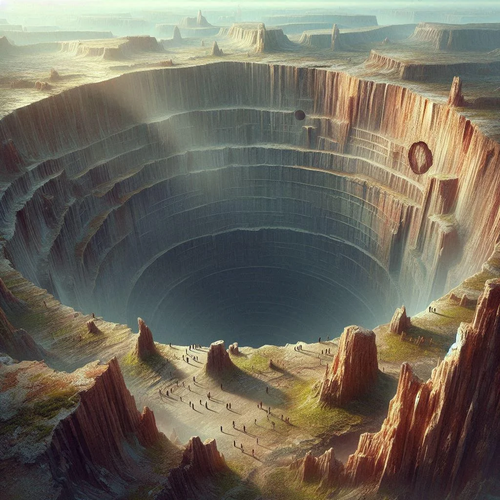

The fey call these gigantic naturally occuring holes Trýpa, many locals have adopted that name too. 
A curse of unknown origin permeates every one of these chasms, but the allure of the treasures within still attract the dominions and miners. 

The chasms are known to lead deep into the earth, as deep as the caverns and some speculate it could go as deep as the abyss.

## Before the Mining Operations
People used to live peacefully in harmony with their surroundings and never venture deep into the holes, they would commune with the spirits and respect and weave the curses to take only what they needed.

## Mining Operations
Notable mining operation in the greater Ramshorn area include Mirefield, but many more villages are scattered all over. If you find a chasm you will find souls desperate enough to go inside.

While coal and iron are being mined on the upper levels, the main target is Indigo Aurora and artifact retrieval from the lower leves of the Chasms.

Since people have started constructing mining equipment in the holes and started venturing deep to extract materials, the curse has gotten worse and the fauna has become more aggressive.
The surface is also affected as the Twisted Forest is starting to petrify. The mutated trees are themselves not dangerous, but behind their fraying barks hides the nefarious mutating wildlife.

## Curse
The curse becomes stronger the deeper someone ventures into the chasms. It is present even at the surface next to a chasm.

Initially the curse progresses slow, causing a feeling of sluggishness and nausea. The curses progression depends on the time spend in a chasm and the depth within.

After passing the surface layer of a chasm the curse starts progressing fast, first causing a desire to lay down and sleep. Venturing even further can kill weakened or sick individuals. It is unclear how this occurs.
> It is vital to move quickly when inside a chasm due to the harsh effects of the curse.

Prolonged or repeated exposure can lead to stage 1 symptoms such as translucent skin, stiff joints and sensitivity to daylight.
When the curse progresses to stage 2 crystals start growing out of the skin and joints. These crystal have similar properties to Indigo Aurora.

A miner that progresses to stage 2 cannot work the chasms anymore and often ends up in crystal slums.

If a individual in stage 2 is experiencing continued exposure to the curse only death ensues.

> Art credit to u/totallynotrobboss