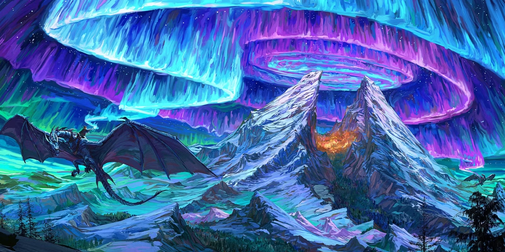

The city at the top of the world, located in the split mountains.
Located in the region known as 'The Roof of the World'.

The festival of lights is held in Lyrengorn once a year and is home to famous Wyvern riders who also perform the Festival of Light.

> *Official art by Kent Davis*