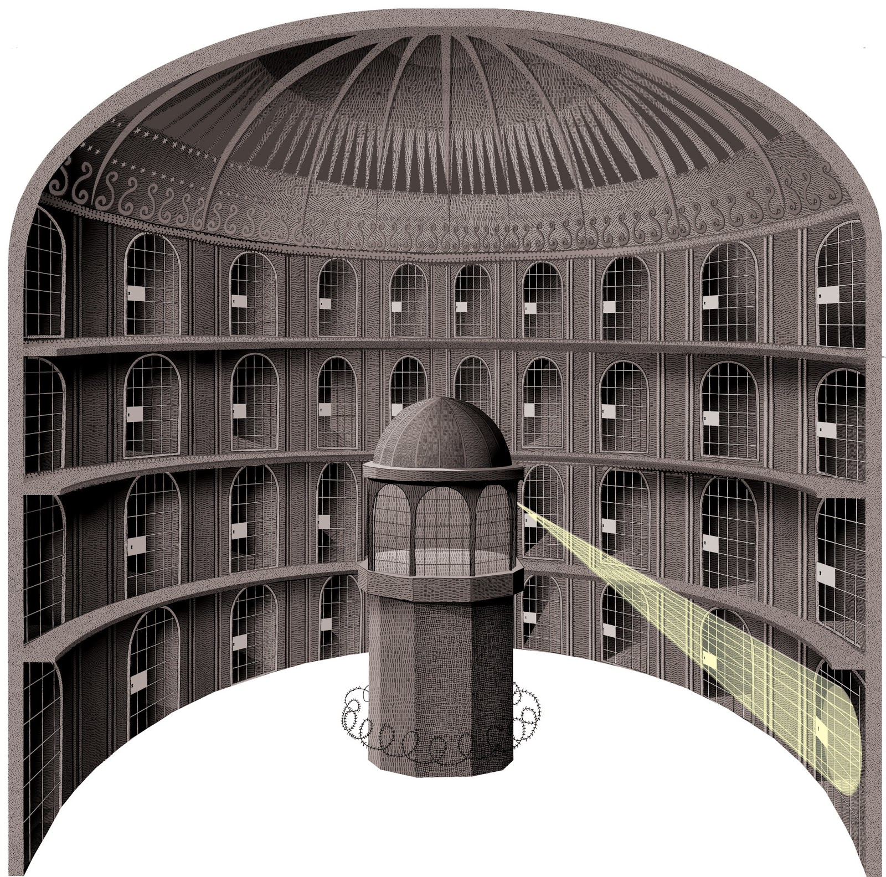

We know little about this place and we do not know where it lies. 

Reveries parents made it into the study grounds before their death. A part of the study grounds resembles a penopticon-style prison-
Reveries parents had communication about the Study grounds with a yet unknown person. TODO

Aaron started working in the study grounds. From him we know the entrance is somewhere in or near Athenaum, but it is not accessible without some special means or spell. 

> The idea of a panopticon prison illustrated