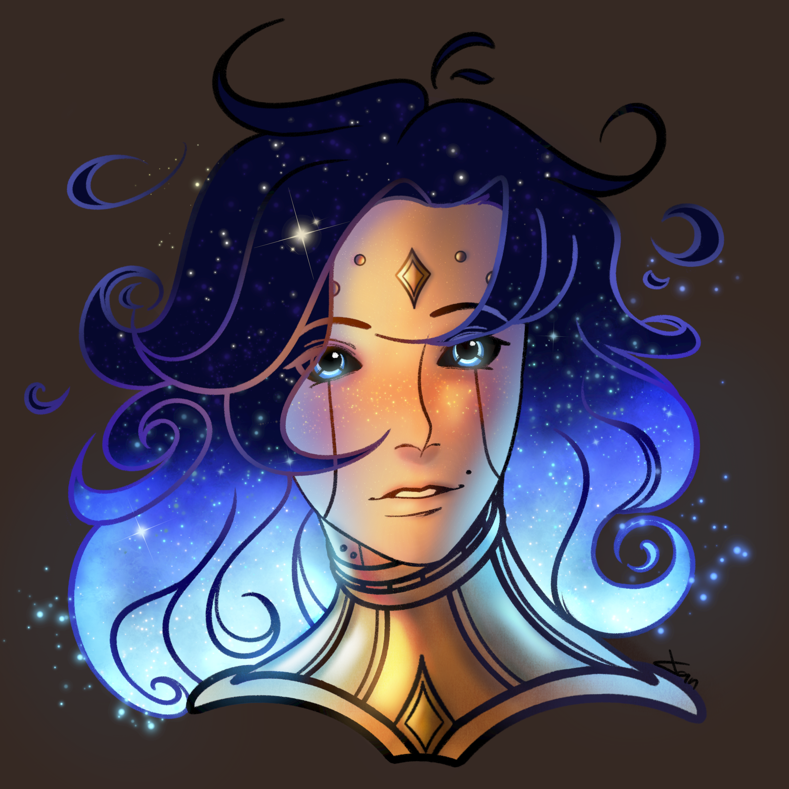

> To remain kind in times of hardship, that is the true essence of humanity

Formerly known as the project "Ornata Homomachina", Carmelio is now driven towards a brand new purpose in life. He aims to usher in a new world from the ashes of the war and nurture it into a place where everyone can coexist in harmony.

Carmelio lived in isolation in a tower near the Seraria Academy, but as the ley lines shifted he fell dormant, only to be awoken by his main creator and the one he considers his father, Percival Mourningbloom.

Now on his own with no further guidance or instruction and still unaware of the horrors of the world he left home and arrived at Marrens Eve, a small mining village controlled by the Ivory dominion. He quickly learned of the dreadful living and working conditions of the inhabitants, as well as the many dangers lurking in the chasm. There he also met two tieflings sisters, Ramira, who became his first ever friend, as well as the one who gave him his current name, and Mavari who continuously remained distrustful and cold towards him.

During this stay, Carmelio was mostly tasked with miscellaneous chores, but he once joined the sisters in an expedition in the mines, the latter turning into a nightmarish excursion from which they barely survived.

Later on, after Carmelio accidently destroyed their village he fled and lost consciousness in a dump yard near Raphia. There he was found by Arkus who brought him home and nursed him back to function.
This is where the first of his many adventures begins as he sets out for Narthwith with his new friend. Despite all that he still remains unknowing of how much the world still has to offer. For the better and for worse.

> Art by the player of Carmelio, our very own Xan

Carmelio possesses two chambers or "hearts" as part of his engine, allowing him to wield both Arcane and Primordial magic.

His faceplate is a latter gift from the combined efforts of Percival, Ana and Zephyr, a precious memento and irreplacable part of his identity.

His soul is composed of the following fragments :
- **Percival Mourningbloom** : Strive, Love, Envy, Disappointment
- **Zephyr Crestfyre** : Happiness, Anger, Anxiety, Sadness, Excitement
- **Ana Mechalistus** : Passion, Calmness, Anticipation, Pride
- **Flynster Blightwing** : Fear, Awe, Suprise, Frustration
- **Edwin Strongfern** : Disgust, Contentment, Doubt, Shame

(Formely but not integral part of him) 
- **Aliana** : Ambition, Courage, Determination, Aspiration

(Defining traits of his being) 
- **Carmelio** : Hope, Devotion, Resilience, Adoration
