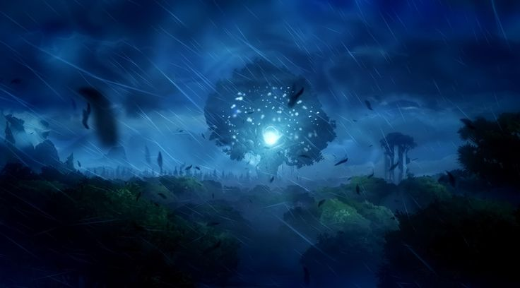

One of the few places where fey roamed until very recently in the mirrorworld. A forest hidden away from the rest of the world by illusions. 
The forest is located next to Mirefield, but even most residents there do not know about this place. 

Some residents have reported seeing visions and hearing voices calling out to them. People who go into that forest usually go missing. Most people avoid it.

## Tree of Light
The forest houses a large tree of light in its center, some believe this to be a primary source of magic and illusions, others suspect it to be a physical manifestation of an aspect of Urmis.

There are a few legends about the forest.
Once explorers reported having found a well of life, nurishing waters that can heal any ailment and a well of mana, replenishing the arcana of weary travelers.
Others says that only those who enter the forest with pure intentions will be guided by the lights, all others will be lost.

Scholars suspect that all of this is explained by activity of Will o Wisps in the area.

Prospectors have tried time and time again to establish access to the many wonders this forest contains, but they were never successful. 

### Protectors of light
A pack of cervitaurs live within and guard the forest of light. They kill those who seek to exploit or harm the forest. 
This pack is comprised of only women, who carry blades of old fey smiths, and still practice old fey swordsmanship.

The cerivtaurs are the only ones who can successfully navigate the forest, this is their most important skill. Every cervitaur completes a coming of age ceremony. Young men start travelling the world, vowing to come back with art, stories and knowledge, women learn to navigate the forest in a fierce trial.

A prospector group arrived with a small army of mercenaries, explosives and lamp oil, burning and cutting a path through the forest. The pack responded brutally, but the fight was not easily won. The fight lasted for days and the cervitaurs knew they posed the greatest threat to the forest. If one of them got captured or controlled, they could lead the path for the prospectors. With their numbers dwindling the cervitaurs retreated to the base of the tree of light and became one with the forest, giving up the earth bound bodies. 

That day Akiras mother send her away. She didnt complete the ceremony yet, she wasn't a threat, she could still have a life.
This is where Akiras story starts.

