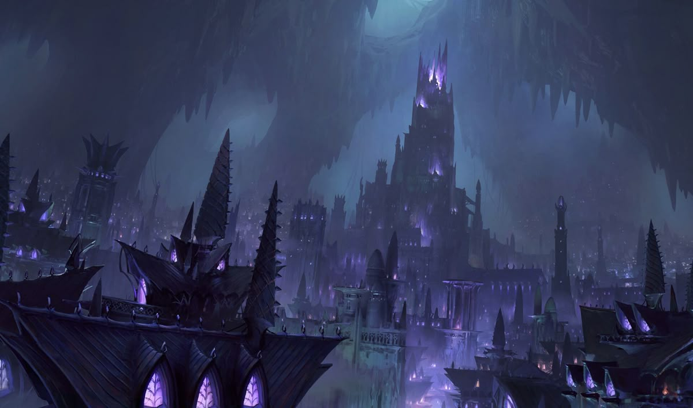

The captial city of Umbra, located in Penumbra and ruled by King Melani Nashira.

The royal court includes Malacoda, Percy and Xia Lueur.

## Faith
Generally Nocros and its aspects are worshipped and present all across umbra but specifically in Menzo Evena, aspect of Urmis and Nesus, Aspect of Nocros are worshipped. In a way this allows both civilians from the surface and umbra to find a faith familiar in this remote place.

## History
Menzo was first ruled by the 12 pillars, who ruled with an iron fist. The 12 pillars were defined by 12 noble houses, their descendants taking over the positions of the parents. 
Only when Mel orchestrated a successful coup against the 12 pillar did the ancient system change. 

After the coup some noble houses which once made up the 12 pillars were still present and their influence too great to just eliminate them all together. From that day onward Mel and the royal court fought hard to make Menzo a the place it is today, a haven for anyone that finds themselves in this corner of the world and a place of acceptance. 

## The War of Light and Shadow
Menzo has faced two wars in recent memory. First the war of shadow and light, when the brightstrider dominion attempted to expand into Umbra and take Menzo. 
People retreated into the city proper which is protected by high walls and the cities own military force, the shadowguard. 
The following siege lasted weeks until the brighstriders finally decided to attack.
Their offense was very effective, breaching the outer walls and quickly engaging in melee combat within the city. 
Thankfully the party was just returning from the hells with support as the brightstriders attacked, allowing them to face Hallorn the Faceless and his steed, the brightstrider general leading the charge. In a tense battle the heroes manages to kill the abyssal general and turn the tide in war. 

## The Ivory Threat
Menzo has not been attacked directly by automaton forces yet, but the threat looms like the sword of damocles. Smaller automaton forces were spotted and quickly eradicated in the cities vicinity as reconstruction is underway. 

## Menzo as a home base

The party, also known by locals as the heroes of Menzo, have aided greatly in Menzo reconstruction efforts. Menzo is the current home base of the party. More can be seen in: Bastion.

> Art by Sean Vo